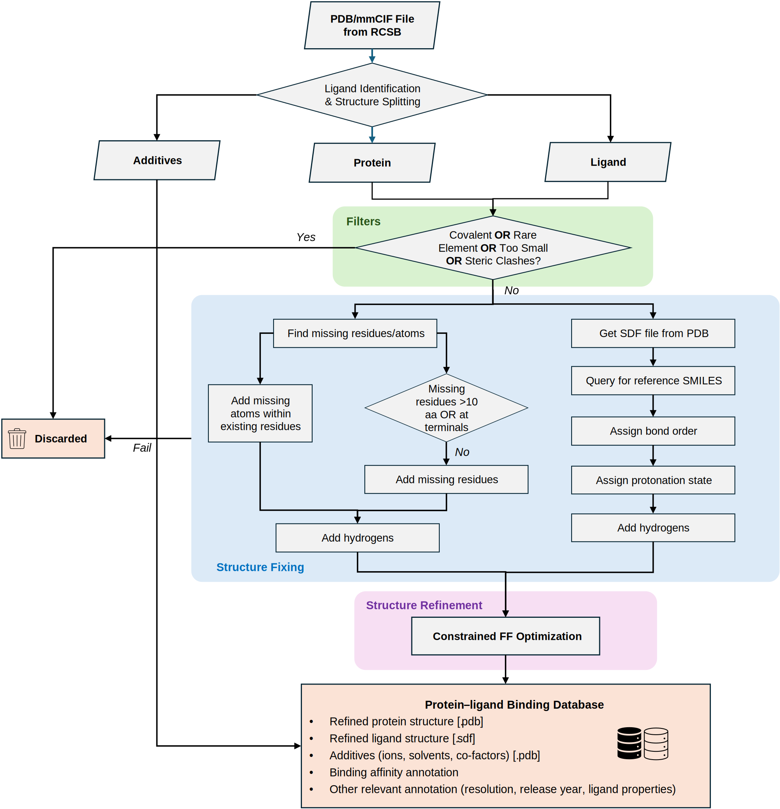

# HiQBind Workflow

[](https://doi.org/10.1039/D4DD00357H)

This repository contains scripts of HiQBind workflow, which organizes a bunch of open-source softwares to probe and fix structural problems in existing Protein-Ligand Datasets.



### License and credits
The HiQBind-WF workflow is open-sourced under MIT license. If you use this code in your work, please kindly cite:
+ Yingze Wang, Kunyang Sun, Jie Li, Xingyi Guan, Oufan Zhang, Dorian Bagni, Yang Zhang, Heather A. Carlson, and Teresa Head-Gordon. "A workflow to create a high-quality protein–ligand binding dataset for training, validation, and prediction tasks." *Digital Discovery* (2025). 


## Setting up and Installation

We recommend using conda environment to install dependencies of this library. Please install (or load) conda and then proceed with the following commands:
```bash
conda env create -f env.yml
conda activate hiqbind-wf
```  

## Code availability

+ `pre_process/`: Scripts to prepare inputs for HiQBind dataset creation and PDBBind optimization (identifying ligands and extract binding affinity data).
+ `workflow/`: Codes for HiQBind-WF worflow
  - `dimorphite_dl`: Package to assign protonation states. We modified the `site_substructures.smarts` to make the rules easier.
  - `fix_ligand.py`: LigandFixer module
  - `fix_protein.py`: ProteinFixer module
  - `process.py`: Main workflow
  - `rcsb.py`: Functions to query RCSB (i.e. downloading files, query SMILES strings)
  - `gather.py`: Functions to create metadata csv files
  - `fix_polymer.py`: Functions to fix polymer ligands
  - `maual_smiles.json`: Manually corrected reference SMILES
  - `building_blocks.csv`: SMILES of alpha-amino acids and common N/C terminal caps. Used to create reference SMILES for polymers
+ `error_fix/`: Contains list of PDB IDs discarded by the workflow when preparing HiQBind and optimizing PDBBind
+ `figshare/`: Metadata of HiQBind dumped in Figshare repo.

## Dataset availability

HiQBind datasets prepared by HiQBind workflow can be found in this [Figshare repoistory](https://doi.org/10.6084/m9.figshare.27430305).
The optimzied PDBBind dataset (PDBBind-opt) is not diectly accessible due to license agreement but users can reproduce the HiQBind dataset following the instructions below.

In this repository, we provide the [metadata](figshare/hiqbind_metadata.csv) of HiQBind and [list of PDB IDs](error_fix/) discarded by the workflow when preparing HiQBind and optimizing PDBBind.

## How to reconstruct HiQBind and Optimized PDBBind

Due to license agreement, we are not able to directly provide the optimized PDBBind dataset, but users can follow the processes listed below to perform optimization on PDBBind or reproduce HiQBind using this workflow.

+ **Step 1**: Download PDBBind index file from their official website.
+ **Step 2a**: Run `pre_process/create_pdbbind_input.ipynb` to extract binding affinity and identifying ligands for PDBBind-Opt. This will give the two csv files: `PDBBind_poly.csv` and `PDBBind_sm.csv`
+ **Step 2b**: Run `pre_process/create_hiqbind_input.ipynb` to extract binding affinity and identifying ligands for HiQBind. This will give the two csv files: `hiq_sm.csv` and `hiq_poly.csv`. Actually, we have already provided these two csv files in `pre_process` directory.
+ **Step 3**: Go to the `workflow` and use the following command to run the workflow
```bash
cd workflow
mkdir ../raw_data
python procees.py -i ../pre_process/hiq_sm.csv -d ../raw_data/hiqbind_sm
python procees.py -i ../pre_process/hiq_poly.csv -d ../raw_data/hiqbind_poly --poly
```
Alternatively, for processing PDBBind, use these codes instead.
```bash
python procees.py -i ../pre_process/PDBBind_sm.csv -d ../raw_data/pdbbind_opt_sm
python procees.py -i ../pre_process/PDBBind_poly.csv -d ../raw_data/pdbbind_opt_poly --poly
```
This will take about one day on a 256-core CPU. If you have more nodes, considering split the input csv file to several chunks and run them in parallel. When the workflow finish, in the output directory, each PDBID will have a folder and if the workflow succeed on this PDBID, there will be a file named `done.tag` under its folder, otherwise ther will be a file named `err`. 
+ **Step 4**: Run the `gather.py` to create metadata files, for example:
```bash
python gather.py -i ../pre_process/PDBBind_sm.csv -d ../raw_data/pdbbind_opt_sm -o ../figshare/pdbbind_opt_sm_metadata.csv
python gather.py -i ../pre_process/PDBBind_poly.csv -d ../raw_data/pdbbind_opt_poly -o ../figshare/pdbbind_opt_poly_metadata.csv
python gather.py -i ../pre_process/hiq_sm.csv -d ../raw_data/hiqbind_sm -o ../figshare/hiqbind_sm_metadata.csv
python gather.py -i ../pre_process/hiq_poly.csv -d ../raw_data/hiqbind_poly -o ../figshare/hiqbind_poly_metadata.csv
```
